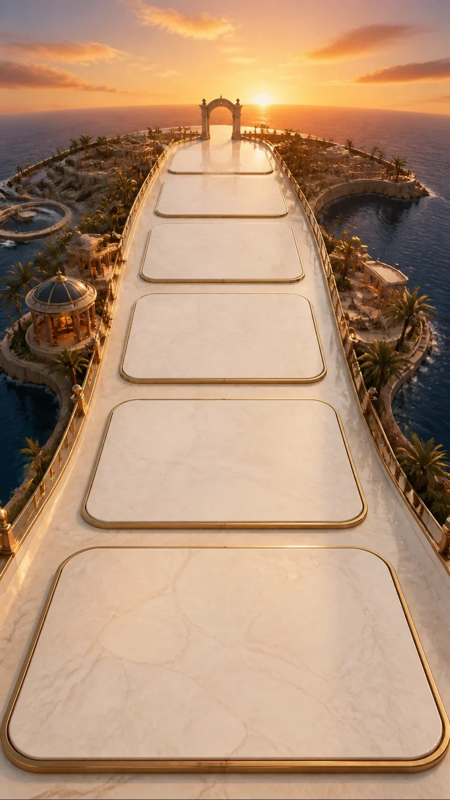
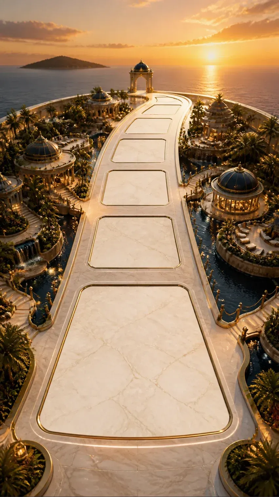

# Fixed Road Window: View Study

## Purpose

全景アトラスの座標合成をやめ、画面内の位置が変わらない「道の窓」を基準にする視点スタディ。道・マス・ゲート・車・建物の画面スロットを固定し、進行に応じてスロットの内容だけを入れ替える。

## Studies

### A. Grand Highway



手前の大きなマスから、まっすぐ夕陽の地平線へ伸びる構図。縦型アーケードレーサーの進行感を最も素直に取り込み、マスの遠近差とゲートの目標性が読みやすい。初回実装の基準として推奨する。

### B. Curved Rim



小さな世界の縁に沿って道が右へ逃げ、水平線へ沈む構図。前進感に加えて「世界を旅する」感覚が強い。奥側の余白がやや小さく、ゲートとホテル区画の競合はAより慎重に調整する必要がある。

## Direction

どちらも真上の盤面ではなく、少し俯瞰した進行方向のカメラ。夕景、クリーム大理石、ネイビーの水面、真鍮の輪郭というGrand Resort Atlasのトーンを維持する。最初の実装基準は、スロット可読性と視点の安定性が高い**A**がよい。

## Fixed Slot Contract

次のベースでは、852 x 1515の自然サイズを基準に、全レイヤーを同じJSONへ収める。実装時は表示幅に対し等比で拡縮するため、座標の再採寸は不要。

```json
{
  "canvas": { "width": 852, "height": 1515 },
  "slots": [
    { "id": "near", "kind": "tile", "cx": 426, "cy": 1225, "width": 640, "height": 300, "rotation": 0 },
    { "id": "current", "kind": "tile", "cx": 426, "cy": 895, "width": 470, "height": 190, "rotation": 0 },
    { "id": "next", "kind": "tile", "cx": 426, "cy": 640, "width": 345, "height": 130, "rotation": 0 },
    { "id": "mid", "kind": "tile", "cx": 426, "cy": 455, "width": 255, "height": 90, "rotation": 0 },
    { "id": "far", "kind": "tile", "cx": 426, "cy": 320, "width": 185, "height": 58, "rotation": 0 }
  ],
  "gate": { "cx": 426, "cy": 255, "width": 118, "height": 142, "rotation": 0 },
  "pawns": {
    "shun": { "cx": 426, "cy": 840, "width": 74, "height": 98, "rotation": 0 },
    "sayano": { "cx": 472, "cy": 855, "width": 58, "height": 78, "rotation": 0 }
  },
  "buildingZones": [
    { "id": "near-left", "cx": 126, "cy": 1000, "width": 180, "height": 170, "rotation": 0 },
    { "id": "near-right", "cx": 726, "cy": 980, "width": 180, "height": 170, "rotation": 0 },
    { "id": "mid-left", "cx": 212, "cy": 580, "width": 140, "height": 125, "rotation": 0 },
    { "id": "mid-right", "cx": 640, "cy": 560, "width": 140, "height": 125, "rotation": 0 },
    { "id": "far-left", "cx": 300, "cy": 360, "width": 95, "height": 88, "rotation": 0 },
    { "id": "far-right", "cx": 552, "cy": 350, "width": 95, "height": 88, "rotation": 0 }
  ]
}
```

このJSONはA案に対応する制作上の座標契約であり、Shunの視点選択後に正確なベース画像と一緒に確定させる。今回のコンセプト画は量産素材・実装用ベースではない。

## Gate Motion Is Deliberately Dynamic

固定なのはカメラとマスのスロットだけで、**ゲートは固定しない**。進行の気持ちよさは、遠い地平線のゲートが近づき、現在地のすぐ先の目標になることで作る。

1. 通常時は地平線の `gate.horizon` に小さく置く。これは画像内の遠景ゲートではなく、透過ゲート素材の合成レイヤーにする。
2. 次のティアへ近づくほど、ゲートを奥から `gate.near` へ補間する。中心は道の軸上を保ち、スケールを `0.26` から `1.00`、不透明度を `0.58` から `1.00` へ上げる。
3. `gate.near` への到達は現在地マスの一つ奥で止める。ユーザーの車は手前の固定スロット、ゲートは次の固定スロットなので、カメラを動かさず「近づいてくる」感覚をつくれる。
4. ティア達成時はゲートが一度だけ開き、0.35秒で薄く抜ける。次のゲートは地平線に小さく再出現させる。画面全体のスクロールや座標の再配置はしない。

推奨イージングは進行中が `cubic-bezier(.22,.61,.36,1)`、到達時が `cubic-bezier(.16,1,.3,1)`。進行に応じた値は宿泊数から決め、閲覧のたびにランダムに動かさない。

```json
{
  "gate": {
    "horizon": { "cx": 426, "cy": 255, "width": 44, "height": 54, "rotation": 0 },
    "near": { "cx": 426, "cy": 455, "width": 118, "height": 142, "rotation": 0 },
    "travel": { "scale": [0.26, 1.0], "opacity": [0.58, 1.0] }
  }
}
```

## Review Questions

1. Aの一直線の目標感か、Bの世界の縁へ回り込む旅感か。
2. マスを5つ固定で見せる密度が適切か。
3. 手前の現在地をさらに車寄りに見せるか、ホテル判子の可読性を優先するか。
