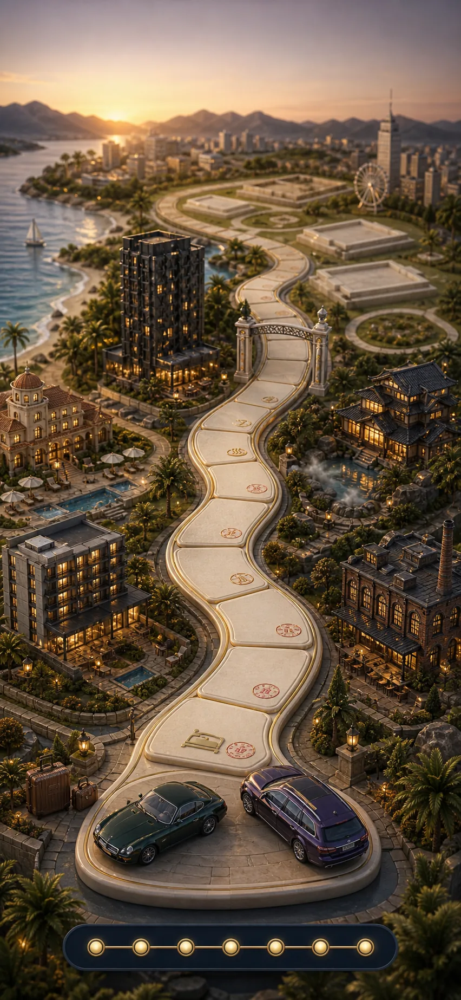
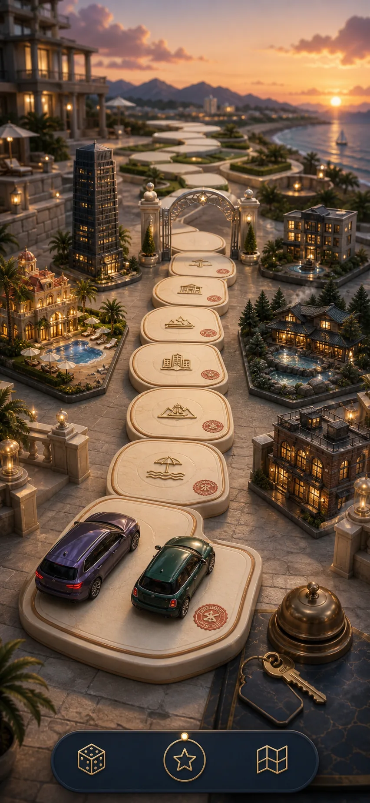
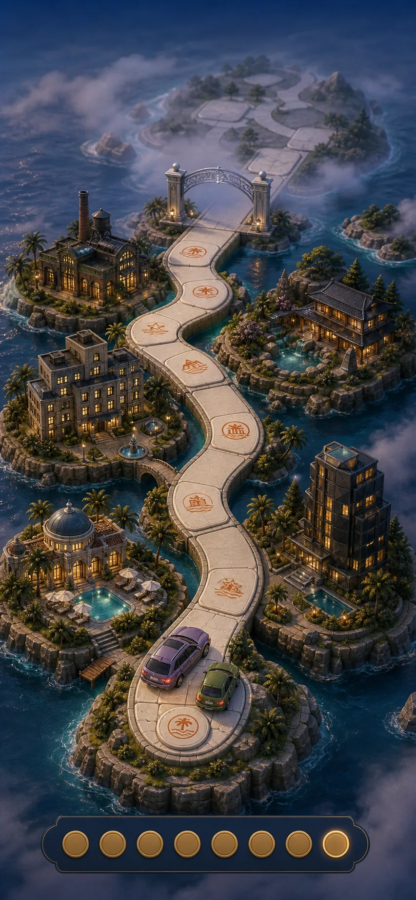

# World Visual Targets

Issue #4のリセット後のアートディレクション用ターゲット。3案とも、現在のダミーデータを同じ条件で描いている。

- 8泊分のクリームの道と朱の判子
- 紫のスポーツワゴンと緑のコンパクトクーペ
- 銀のティアゲート
- 5軒分の建築ミニチュア: ビーチリゾート、都市型デザインホテル、都市コートヤード、山の温泉宿、インダストリアルなブティックホテル
- 先の章には未建設の区画を残す

共通の質感は、艶を抑えた磁器・クレイ・石灰岩・ネイビーエナメル・鈍い真鍮。王冠、宝石、原色、ロゴ、読める文字は使わない。

## A. Grand Resort Atlas

`world-atlas-a.webp` は、地図のように広がる世界と、道の周囲に建つ宿のコレクション性を最も強くした案。

泊まるたびに道の脇の空き区画へホテルのミニチュアと庭が一棟ずつ増え、前年の道は育ち切った旅の地図になる。

## B. Concierge Terrace Diorama

`concierge-terrace-b.webp` は、夕景の高級リゾートのテラスを舞台に、手前から銀ゲートの先へ道が消える没入感を最も強くした案。

泊まるたびにコンシェルジュテラスの両側へホテル棟や庭、プールが増え、帰ってくるたびに自分たち専用のリゾートが豊かになる。

## C. Archipelago Chapters

`archipelago-chapters-c.webp` は、島と橋をティアの章として扱い、銀ゲートの先に未開拓の島を見せる案。

泊まるたびに島の一角へ宿が建ち、ティア到達で霧の向こうの新しい島と未建設区画が開く。

## 選定の見方

- **A**: 「泊まった宿の世界地図」を長く眺める楽しさが主役
- **B**: 「今この旅の中にいる」没入感と3Dのリッチさが主役
- **C**: 「ティアごとに新しい旅の章が開く」進行感が主役

いずれを選んでも、実装時は背景一枚の上に、宿の建物スプライト・判子・駒・ゲートをアンカー座標で重ね、宿泊データから表示を育てる。
